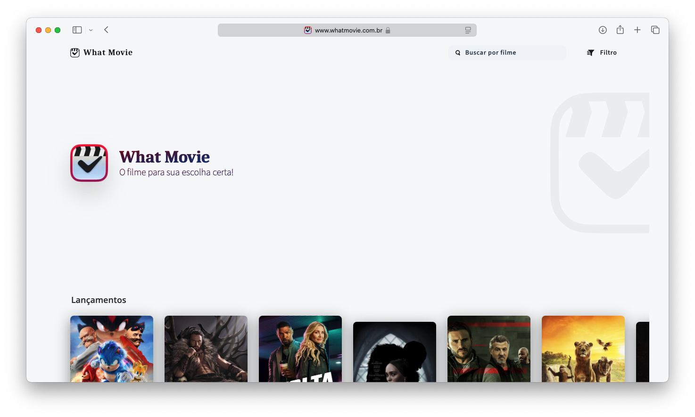
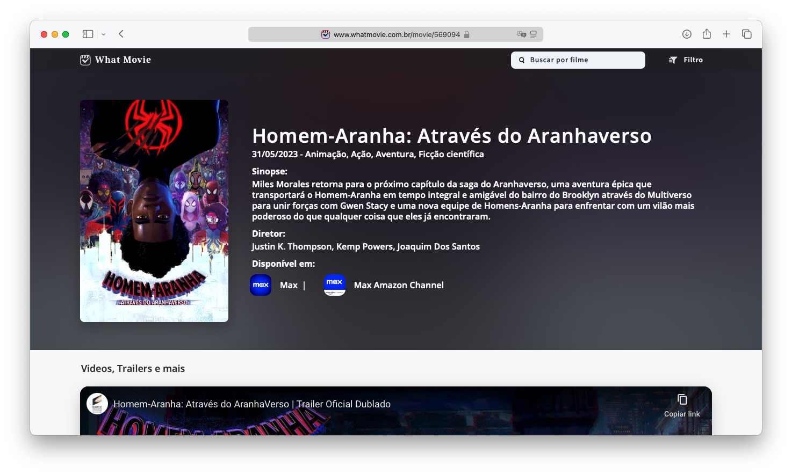
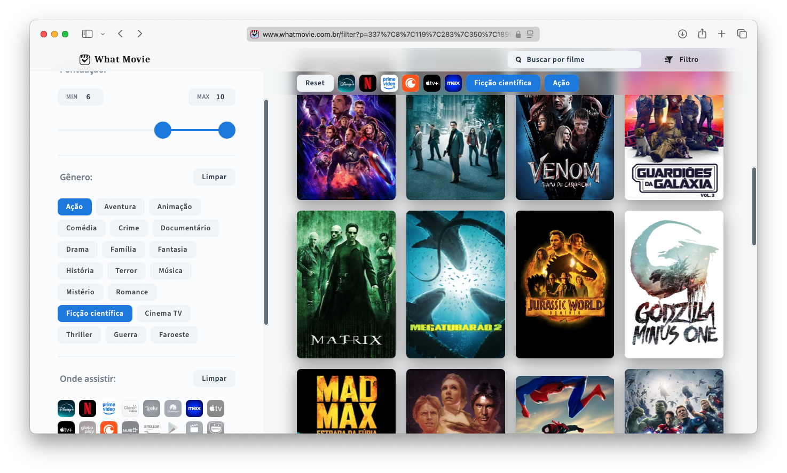

<div align="center">
    
    
</div>

## [🔗 WhatMovie.com.br](https://www.whatmovie.com.br)

Um site desenvolvido para amantes de filmes, com o objetivo de facilitar a descoberta e pesquisa de informações sobre filmes. O WhatMovie utiliza API fornecida pelo [The Movie Database (TMDB)](https://www.themoviedb.org/?language=pt-BR) para fornecer dados atualizados sobre filmes em seus serviços de streaming com uma experiência de navegação intuitiva, moderna e responsiva.

## 🛠️ Tecnologias Utilizadas

<div style="display: inline_block"> 
     
     
     
     
</div>

## ✨ Funcionalidades

- Página inicial com lançamentos recentes nos serviços de streaming.
- Pesquisa por nome de filmes.
- Filtros para explorar filmes por categorias.
- Página de informações detalhadas sobre cada filme, incluindo sinopse, elenco e muito mais.
- Design responsivo e mobile-first para ótima experiência em qualquer dispositivo.
- Renderização no lado do servidor (SSR) para otimizar o desempenho e melhorar o SEO do site.

## 📷 Screenshots

### Página Inicial



### Página de Detalhes



### Página de filtro



## 🚀 Como Rodar o Projeto

### Pré-requisitos

- [**Node.js**](https://nodejs.org/pt) - 18.17 ou superior.
- [**TMDB API KEY**](https://developer.themoviedb.org/docs/getting-started) - Este projeto usa REST API fornecida pelo TMDB para fornecer os dados.
- Gerenciador de pacotes como `npm` ou `yarn`.

### Passos

1. Clone este repositório:

```bash
git clone https://github.com/"SeuUsuario"/whatmovie.git
```

2. Navegue até o diretório do projeto:

```bash
cd whatmovie
```

3. Instale as dependências:

```bash
npm install
# ou
yarn install
```

4. Configure a API:

- Crie um arquivo `.env.local` na raiz do projeto.
- Adicione sua chave de API:

```
DB_TOKEN_AUTH='Sua_Chave_API'
```

5. Rode o projeto:

```bash
npm run dev
# ou
yarn dev
```

6. Acesse o site no navegador:

```
http://localhost:3000
```

## 🙌 Feedback

Embora este projeto tenha sido desenvolvido principalmente como um estudo e prática de desenvolvimento web, ficarei feliz em receber qualquer tipo de feedback ou sugestão para melhorá-lo! Você pode entrar em contato comigo diretamente pelo e-mail ou LinkedIn listados abaixo.

## 📧 Contato

Se tiver dúvidas, sugestões ou quiser entrar em contato, me encontre em:

- [LinkedIn](https://www.linkedin.com/in/michaelhjacob/)
- Email: `michael_h.jacob@outlook.com`
